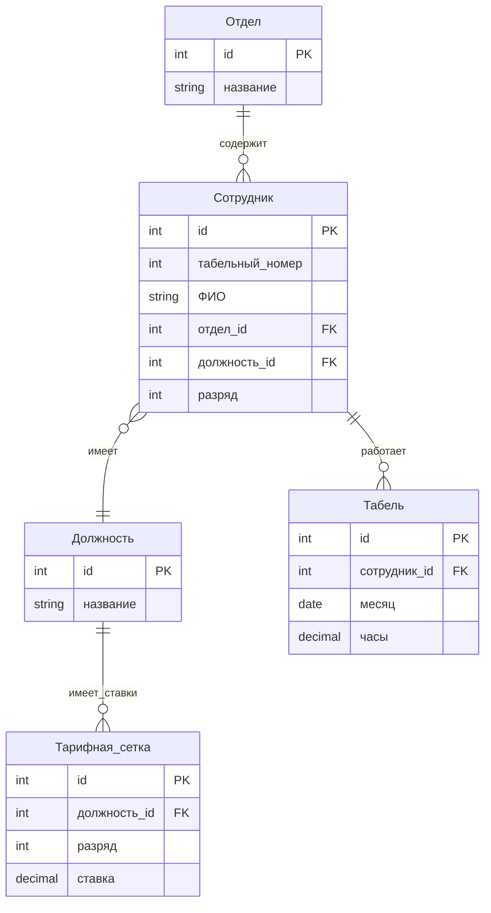
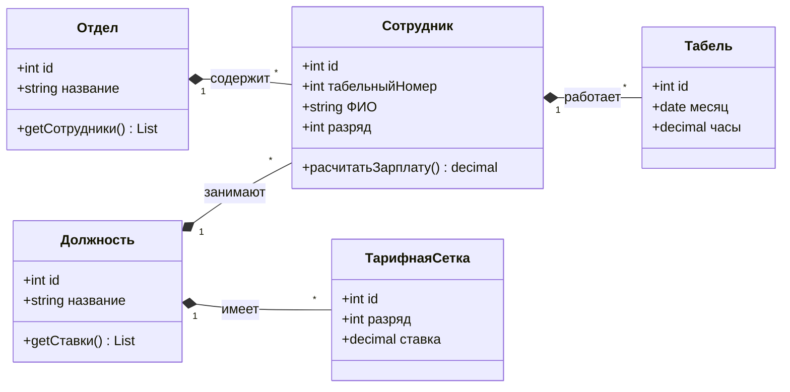
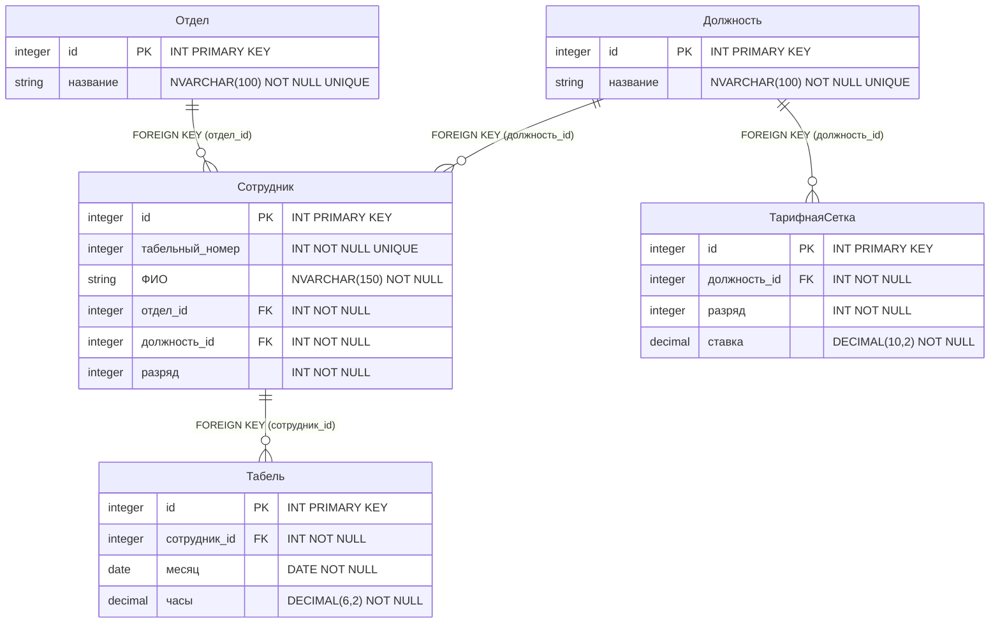

# Лабораторная работа 1 по дисциплине "Базы данных"
## ФИО студента, номер учебной группы
Притечко Арсений Николаевич, 2262-ДБ
## Вариант 20: "Зарплата"
Имеются сведения об отделах (название отдела) и тарифная сетка
(должность, разряд (от 7 до 15),ставка (руб/час)). Работник, имеющий
табельный номер, ФИО, должность и разряд, работает в некотором
отделе. Ежемесячно заполняется табель, определяющий, какое число
часов отработал определенный работник.

Выходные документы:
* Список зарплат сотрудников с указанием их должности за
определенный месяц, упорядоченный по отделам и ФИО
сотрудников
* Список отделов с указанием количества лиц с определенным
разрядом, упорядоченный по отделам

## ER-Диаграмма

## Сущности:
* Отдел - единица предприятия, где работают сотрудники. Имеет уникальное название и может содержать несколько сотрудников.
* Должность - определяет требования, которые выполняет сотрудник. Имеет тарифные ставки по разрядам.
* Тарифная стека - определяет ставку в час.
* Сотрудник - работник предприятия со своим табельным номером.
* Табель - фиксирует количество отработанных часов для расчета заработной платы.

## Логическая модель в виде диаграммы классов UML-2.4

## Связи между сущностями:
* Отдел -> Сотрудник (Тип: Один ко многим 1:N)
* Должность -> Сотрудник (Тип: Один ко многим 1:N)
* Должность -> Тарифная сетка (Тип: Один ко многим 1:N)
* Сотрудник -> Табель (Тип: Один ко многим 1:N)

## Физическая модель:

